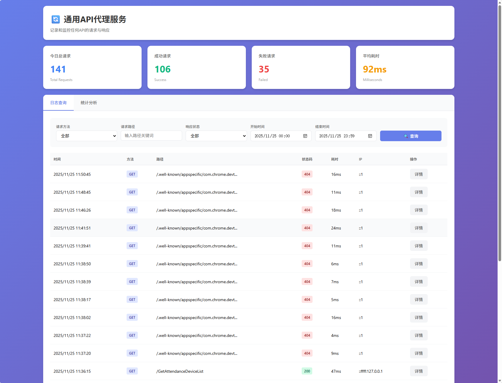
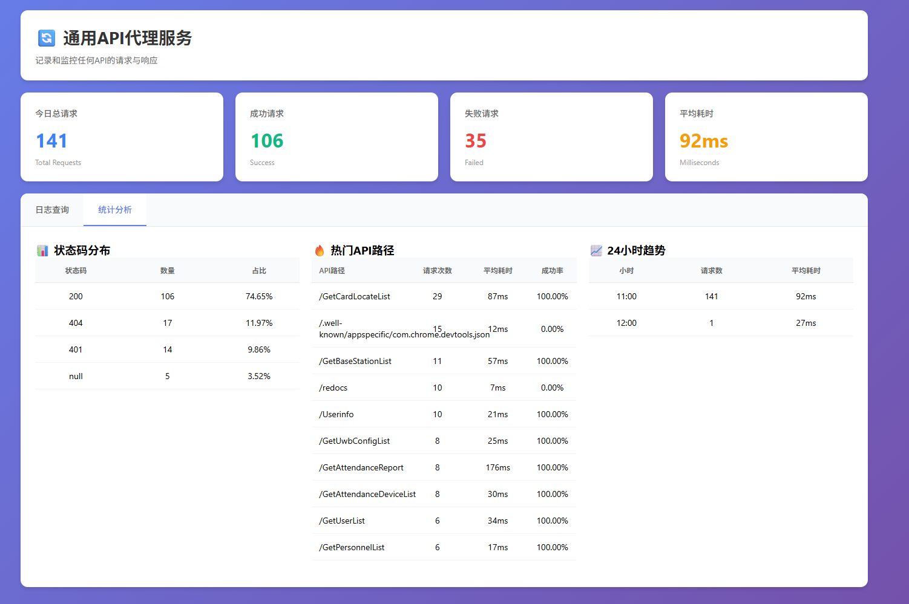

# API Proxy Logger 🚀

[](https://nodejs.org/)
[](https://opensource.org/licenses/MIT)
[](https://www.mysql.com/)
[]()

> **通用API代理服务** - 基于 Node.js + Express + MySQL 的API代理与日志记录系统，支持任何HTTP API的透明代理和完整监控。

## 📸 截图预览

### 🎯 管理后台

- **实时监控**: 查看API请求状态和性能指标
- **智能筛选**: 支持多条件组合查询
- **详细统计**: 状态码分布、热门API、时间趋势分析

### 📊 统计分析

- **状态码分布**: 实时了解API健康状态
- **热门路径**: 识别高频访问接口
- **时间趋势**: 分析24小时访问模式

---

## ✨ 核心特性

### 🔄 **通用代理**
- 🌐 **支持所有HTTP方法**: GET/POST/PUT/DELETE/PATCH/HEAD/OPTIONS
- 🎯 **透明转发**: 完整保留请求头、查询参数、请求体
- 📡 **任意API**: 可代理任何HTTP API服务
- 🛡️ **协议兼容**: 支持HTTP/HTTPS目标服务

### 📊 **完整记录**
- 📝 **请求详情**: URL、方法、头部、查询参数、请求体
- 📬 **响应详情**: 状态码、响应头、响应体
- ⏱️ **性能指标**: 请求耗时、成功率统计
- 🌍 **客户端信息**: IP地址、User-Agent

### 🎛️ **管理后台**
- 🔐 **安全认证**: Basic Auth保护
- 🔍 **高级搜索**: 多条件筛选和分页
- 📈 **实时统计**: 今日概览和趋势分析
- 📱 **响应式设计**: 支持桌面和移动端

### ⚡ **高性能**
- 🚀 **异步日志**: 响应优先，日志异步记录
- 💾 **连接池**: MySQL连接池优化
- 📏 **智能限流**: 16MB请求体限制
- 🔄 **热重载**: 开发环境支持

## 🚀 快速开始

### 📋 环境要求

- **Node.js** >= 14.0.0
- **MySQL** >= 5.7
- **npm** 或 **yarn**

### ⚙️ 安装部署

```bash
# 1. 克隆项目
git clone https://github.com/ardondon/api_proxy_logs.git
cd api_proxy_logs

# 2. 安装依赖
npm install

# 3. 配置环境变量
cp .env.example .env
# 编辑 .env 文件设置数据库和目标API

# 4. 初始化数据库
npm run init-db

# 5. 启动服务
npm run dev
```

### 🔧 环境配置

编辑 `.env` 文件：

```env
# 服务配置
PORT=8098
NODE_ENV=development

# MySQL数据库配置
DB_HOST=localhost
DB_PORT=3306
DB_USER=root
DB_PASSWORD=your_mysql_password
DB_NAME=api_proxy_logs

# 目标API配置
TARGET_API_URL=https://api.example.com

# 管理后台配置
ADMIN_USERNAME=admin
ADMIN_PASSWORD=your_secure_password
```

### 🌐 访问地址

| 服务 | 地址 | 说明 |
|------|------|------|
| **管理后台** | `http://localhost:8098/api_proxy_logs/admin.html` | Web管理界面 |
| **健康检查** | `http://localhost:8098/api_proxy_logs/health` | 服务状态 |
| **API代理** | `http://localhost:8098/*` | 转发所有其他请求 |

## � 使用指南

### 🔀 API代理使用

**基本代理规则**：
```
客户端请求: http://localhost:8098/users/123
实际转发到: TARGET_API_URL/users/123
```

**示例**：
```bash
# 配置 TARGET_API_URL=https://api.github.com

# 获取用户信息
curl http://localhost:8098/users/octocat
# 实际请求: https://api.github.com/users/octocat

# 创建仓库
curl -X POST http://localhost:8098/user/repos -d '{"name":"my-repo"}'
# 实际请求: https://api.github.com/user/repos
```

### 📊 管理后台操作

1. **访问管理后台**: `http://localhost:8098/api_proxy_logs/admin.html`
2. **登录认证**: 使用 `.env` 中配置的用户名密码
3. **查看日志**: 在"日志查询"标签页筛选和查看请求记录
4. **统计分析**: 在"统计分析"标签页查看各种统计图表

---

## 🏗️ 项目架构

```
api_proxy_logs/
├── 📁 src/                    # 源代码目录
│   ├── 📄 app.js             # 应用入口文件
│   ├── 📁 config/            # 配置文件
│   │   ├── 📄 database.js    # 数据库配置
│   │   └── 📄 logger.js      # 日志配置
│   ├── 📁 models/            # 数据模型
│   │   └── 📄 logModel.js    # 日志模型
│   ├── 📁 routes/            # 路由定义
│   │   ├── 📄 adminRoutes.js # 管理路由
│   │   └── 📄 proxyRoutes.js # 代理路由
│   ├── 📁 services/          # 业务服务
│   │   └── 📄 proxyService.js # 代理服务
│   └── 📁 scripts/           # 工具脚本
│       └── 📄 initDatabase.js # 数据库初始化
├── 📁 public/                 # 静态资源
│   └── 📄 admin.html         # 管理后台页面
├── 📁 logs/                   # 日志文件目录
├── 📄 .env.example           # 环境变量示例
├── 📄 package.json           # 项目配置
└── 📄 README.md              # 项目文档
```

## � API文档

### 🔀 代理接口

**所有HTTP方法**支持透明代理：

| 方法 | 路径 | 转发目标 |
|------|------|----------|
| ANY | `/*` | `TARGET_API_URL/*` |

**保留路径**: `/api_proxy_logs/*` 为管理后台专用

**特性**：
- ✅ 完整保留请求头、查询参数、请求体
- ✅ 透传响应头和响应体
- ✅ 自动记录完整的HTTP交互
- ✅ 支持任意数据格式（JSON/XML/FormData等）

### 📊 管理接口

#### 🔍 查询日志
```http
GET /api_proxy_logs/admin/logs
Authorization: Basic base64(username:password)
```

**查询参数**:
- `page`: 页码 (默认: 1)
- `pageSize`: 每页数量 (默认: 20)
- `requestMethod`: HTTP方法筛选
- `requestPath`: 路径模糊搜索
- `responseStatus`: 状态码筛选
- `success`: 成功状态筛选 (true/false)
- `startDate`: 开始时间 (datetime-local格式)
- `endDate`: 结束时间 (datetime-local格式)

#### 📈 统计分析
```http
GET /api_proxy_logs/admin/stats/status-codes    # 状态码分布
GET /api_proxy_logs/admin/stats/top-paths       # 热门API路径
GET /api_proxy_logs/admin/stats/hourly-trend    # 小时趋势
GET /api_proxy_logs/admin/overview              # 今日概览
```

## 🗄️ 数据库设计

### 📊 api_logs 表

| 字段 | 类型 | 说明 |
|------|------|------|
| id | BIGINT | 主键ID |
| request_id | VARCHAR(64) | 请求唯一标识 |
| request_method | VARCHAR(10) | HTTP方法 |
| request_url | VARCHAR(1000) | 完整请求URL |
| request_path | VARCHAR(500) | 请求路径 |
| request_query | TEXT | 查询参数JSON |
| request_headers | TEXT | 请求头JSON |
| request_body | MEDIUMTEXT | 请求体内容 |
| response_status | INT | HTTP状态码 |
| response_headers | TEXT | 响应头JSON |
| response_body | MEDIUMTEXT | 响应体内容 |
| duration | INT | 请求耗时(ms) |
| success | TINYINT(1) | 请求是否成功 |
| error_message | VARCHAR(1000) | 错误信息 |
| ip_address | VARCHAR(50) | 客户端IP |
| user_agent | VARCHAR(500) | 用户代理 |
| created_at | TIMESTAMP | 创建时间 |

---

## 🚀 生产部署

### 🐳 Docker部署

```dockerfile
# Dockerfile示例
FROM node:16-alpine
WORKDIR /app
COPY package*.json ./
RUN npm ci --only=production
COPY . .
EXPOSE 8098
CMD ["npm", "start"]
```

```bash
# 构建和运行
docker build -t api-proxy-logger .
docker run -d -p 8098:8098 --env-file .env api-proxy-logger
```

### ⚡ PM2部署 (推荐)

```bash
# 安装PM2
npm install -g pm2

# 生产环境启动
NODE_ENV=production pm2 start src/app.js --name api-proxy-logger

# 设置开机自启
pm2 startup && pm2 save

# 监控服务
pm2 monit
```

### 🔄 Nginx反向代理

```nginx
server {
    listen 80;
    server_name your-domain.com;
    
    location / {
        proxy_pass http://localhost:8098;
        proxy_set_header Host $host;
        proxy_set_header X-Real-IP $remote_addr;
        proxy_set_header X-Forwarded-For $proxy_add_x_forwarded_for;
    }
}
```

---

## 📈 性能指标

| 指标 | 数值 | 说明 |
|------|------|------|
| **QPS** | 3,000-5,000 | 含日志记录和数据库写入 |
| **延迟** | 80-150ms | 平均响应延迟 |
| **连接池** | 10个连接 | MySQL连接池大小 |
| **内存占用** | ~50MB | 运行时内存使用 |
| **日志保留** | 30天 | 自动清理历史数据 |

---

## 🔧 配置详解

### 📝 环境变量

| 变量名 | 说明 | 默认值 | 必填 |
|--------|------|--------|------|
| `PORT` | 服务端口 | 8098 | ❌ |
| `NODE_ENV` | 运行环境 | development | ❌ |
| `DB_HOST` | MySQL主机 | localhost | ✅ |
| `DB_PORT` | MySQL端口 | 3306 | ❌ |
| `DB_USER` | 数据库用户 | root | ✅ |
| `DB_PASSWORD` | 数据库密码 | - | ✅ |
| `DB_NAME` | 数据库名 | api_proxy_logs | ✅ |
| `TARGET_API_URL` | 目标API地址 | - | ✅ |
| `ADMIN_USERNAME` | 管理员用户名 | admin | ❌ |
| `ADMIN_PASSWORD` | 管理员密码 | admin123 | ❌ |

### 🛡️ 安全特性

- **请求体限制**: 16MB，超过返回413错误
- **数据保护**: 敏感数据原样记录，支持审计
- **认证保护**: 管理后台Basic Auth认证
- **SQL注入防护**: 使用参数化查询

---

## ❓ 常见问题

### 🔧 安装配置

**Q: 数据库连接失败怎么办？**
```bash
# 检查MySQL服务状态
systemctl status mysql

# 测试连接
mysql -h localhost -u root -p

# 检查.env配置
cat .env
```

**Q: 如何修改管理后台密码？**
```bash
# 编辑.env文件
ADMIN_USERNAME=new_user
ADMIN_PASSWORD=new_password

# 重启服务
pm2 restart api-proxy-logger
```

### 🚀 运行问题

**Q: 代理请求失败？**
- 检查 `TARGET_API_URL` 配置是否正确
- 确认目标API服务是否可访问
- 查看应用日志获取详细错误信息

**Q: 如何查看实时日志？**
```bash
# 开发模式
npm run dev

# PM2模式
pm2 logs api-proxy-logger

# 文件日志
tail -f logs/$(date +%Y-%m-%d)-app.log
```

### � 数据管理

**Q: 如何清理历史数据？**
```sql
-- 删除30天前的日志
DELETE FROM api_logs WHERE created_at < DATE_SUB(NOW(), INTERVAL 30 DAY);

-- 优化表结构
OPTIMIZE TABLE api_logs;
```

---

## 🤝 贡献指南

我们欢迎所有形式的贡献！请遵循以下步骤：

### 🌟 贡献方式

1. **🍴 Fork 项目** 到你的GitHub账户
2. **🌿 创建特性分支**: `git checkout -b feature/amazing-feature`
3. **💻 提交更改**: `git commit -m 'Add amazing feature'`
4. **� 推送分支**: `git push origin feature/amazing-feature`
5. **🔄 创建 Pull Request**

### � 开发规范

- **代码风格**: 使用 ESLint 和 Prettier
- **提交信息**: 遵循 Conventional Commits 规范
- **测试**: 确保所有测试通过
- **文档**: 更新相关文档和注释

### 🐛 报告问题

- 使用 [Issues](https://github.com/ardondon/api_proxy_logs/issues) 报告bug
- 提供详细的重现步骤和环境信息
- 包含相关的错误日志和截图

---

## � 更新日志

### 🎉 v2.0.0 (2025-11-25)

#### ✨ 新增功能
- 🎯 **通用代理**: 支持任意HTTP API代理
- 📊 **统计分析**: 状态码分布、热门路径、时间趋势
- 🔍 **高级筛选**: 支持时间范围精确筛选
- 📱 **界面优化**: 响应式设计和表格列宽优化

#### � 改进优化
- ⚡ **性能提升**: 优化MySQL查询和连接池
- 🛡️ **安全加固**: 完善认证和数据处理
- 📝 **文档完善**: 重构README和API文档

#### 🐛 问题修复
- ✅ 修复MySQL兼容性问题
- ✅ 修复日期筛选时间范围问题
- ✅ 修复统计表格显示问题

---

## 📄 许可证

本项目采用 [MIT License](LICENSE) 开源协议。

---

## 🙏 致谢

感谢以下开源项目：

- **[Express.js](https://expressjs.com/)** - Web框架
- **[MySQL2](https://github.com/sidorares/node-mysql2)** - MySQL驱动
- **[Winston](https://github.com/winstonjs/winston)** - 日志库
- **[PM2](https://github.com/Unitech/pm2)** - 进程管理

---

## 📞 联系方式

- **GitHub**: [@ardondon](https://github.com/ardondon)
- **Issues**: [提交问题](https://github.com/ardondon/api_proxy_logs/issues)
- **邮箱**: [your-email@example.com]

---

<div align="center">

**⭐ 如果这个项目对你有帮助，请给我们一个Star！**

Made with ❤️ by [ardondon](https://github.com/ardondon)

</div>

